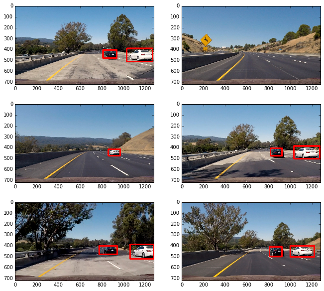

# Vehicle Detection Project

This is a project for Udacity self-driving car Nanodegree program. The aim of this project is to detect the vehicles in a dash camera video. The implementation of the project is in the file vehicle_detection.ipynb. The final video output is [here](https://www.youtube.com/watch?v=PncSIx8AHTs).

In this README, each step in the pipeline will be explained in details.

## Introduction to object detection

Detecting vehicles in a video stream is an object detection problem. An object detection problem can be approached as either a classification problem or a regression problem. As a classification problem, the image are divided into small patches, each of which will be run through a classifier to determine whether there are objects in the patch. Then the bounding boxes will be assigned to locate around patches that are classified with high probability of present of an object. In the regression approach, the whole image will be run through a convolutional neural network to directly generate one or more bounding boxes for objects in the images.

| classification                                                                                                                               | regression                                               |
|----------------------------------------------------------------------------------------------------------------------------------------------|----------------------------------------------------------|
| Classification on portions of the image to determine objects, generate bounding boxes for regions that have positive classification results. | Regression on the whole image to generate bounding boxes |
| 1. sliding window + HOG 2. sliding window + CNN 3. region proposals + CNN                                                                    | generate bounding box coordinates directly from CNN      |
| RCNN, Fast-RCNN, Faster-RCNN                                                                                                                 | SSD, YOLO                                                |

In this project, we will use tiny-YOLO v1, since it's easy to implement and are reasonably fast.


## The tiny-YOLO v1

### Architecture of the convolutional neural network

The tiny YOLO v1 is consist of 9 convolution layers and 3 full connected layers. Each convolution layer consists of convolution, leaky relu and max pooling operations. The first 9 convolution layers can be understood as the feature extractor, whereas the last three full connected layers can be understood as the "regression head" that predicts the bounding boxes.


There are a total of 45,089,374 parameters in the model and the detail of the architecture is in list in this table


    ____________________________________________________________________________________________________
    Layer (type)                     Output Shape          Param #     Connected to                     
    ====================================================================================================
    convolution2d_1 (Convolution2D)  (None, 16, 448, 448)  448         convolution2d_input_1[0][0]      
    ____________________________________________________________________________________________________
    leakyrelu_1 (LeakyReLU)          (None, 16, 448, 448)  0           convolution2d_1[0][0]            
    ____________________________________________________________________________________________________
    maxpooling2d_1 (MaxPooling2D)    (None, 16, 224, 224)  0           leakyrelu_1[0][0]                
    ____________________________________________________________________________________________________
    convolution2d_2 (Convolution2D)  (None, 32, 224, 224)  4640        maxpooling2d_1[0][0]             
    ____________________________________________________________________________________________________
    leakyrelu_2 (LeakyReLU)          (None, 32, 224, 224)  0           convolution2d_2[0][0]            
    ____________________________________________________________________________________________________
    maxpooling2d_2 (MaxPooling2D)    (None, 32, 112, 112)  0           leakyrelu_2[0][0]                
    ____________________________________________________________________________________________________
    convolution2d_3 (Convolution2D)  (None, 64, 112, 112)  18496       maxpooling2d_2[0][0]             
    ____________________________________________________________________________________________________
    leakyrelu_3 (LeakyReLU)          (None, 64, 112, 112)  0           convolution2d_3[0][0]            
    ____________________________________________________________________________________________________
    maxpooling2d_3 (MaxPooling2D)    (None, 64, 56, 56)    0           leakyrelu_3[0][0]                
    ____________________________________________________________________________________________________
    convolution2d_4 (Convolution2D)  (None, 128, 56, 56)   73856       maxpooling2d_3[0][0]             
    ____________________________________________________________________________________________________
    leakyrelu_4 (LeakyReLU)          (None, 128, 56, 56)   0           convolution2d_4[0][0]            
    ____________________________________________________________________________________________________
    maxpooling2d_4 (MaxPooling2D)    (None, 128, 28, 28)   0           leakyrelu_4[0][0]                
    ____________________________________________________________________________________________________
    convolution2d_5 (Convolution2D)  (None, 256, 28, 28)   295168      maxpooling2d_4[0][0]             
    ____________________________________________________________________________________________________
    leakyrelu_5 (LeakyReLU)          (None, 256, 28, 28)   0           convolution2d_5[0][0]            
    ____________________________________________________________________________________________________
    maxpooling2d_5 (MaxPooling2D)    (None, 256, 14, 14)   0           leakyrelu_5[0][0]                
    ____________________________________________________________________________________________________
    convolution2d_6 (Convolution2D)  (None, 512, 14, 14)   1180160     maxpooling2d_5[0][0]             
    ____________________________________________________________________________________________________
    leakyrelu_6 (LeakyReLU)          (None, 512, 14, 14)   0           convolution2d_6[0][0]            
    ____________________________________________________________________________________________________
    maxpooling2d_6 (MaxPooling2D)    (None, 512, 7, 7)     0           leakyrelu_6[0][0]                
    ____________________________________________________________________________________________________
    convolution2d_7 (Convolution2D)  (None, 1024, 7, 7)    4719616     maxpooling2d_6[0][0]             
    ____________________________________________________________________________________________________
    leakyrelu_7 (LeakyReLU)          (None, 1024, 7, 7)    0           convolution2d_7[0][0]            
    ____________________________________________________________________________________________________
    convolution2d_8 (Convolution2D)  (None, 1024, 7, 7)    9438208     leakyrelu_7[0][0]                
    ____________________________________________________________________________________________________
    leakyrelu_8 (LeakyReLU)          (None, 1024, 7, 7)    0           convolution2d_8[0][0]            
    ____________________________________________________________________________________________________
    convolution2d_9 (Convolution2D)  (None, 1024, 7, 7)    9438208     leakyrelu_8[0][0]                
    ____________________________________________________________________________________________________
    leakyrelu_9 (LeakyReLU)          (None, 1024, 7, 7)    0           convolution2d_9[0][0]            
    ____________________________________________________________________________________________________
    flatten_1 (Flatten)              (None, 50176)         0           leakyrelu_9[0][0]                
    ____________________________________________________________________________________________________
    dense_1 (Dense)                  (None, 256)           12845312    flatten_1[0][0]                  
    ____________________________________________________________________________________________________
    dense_2 (Dense)                  (None, 4096)          1052672     dense_1[0][0]                    
    ____________________________________________________________________________________________________
    leakyrelu_10 (LeakyReLU)         (None, 4096)          0           dense_2[0][0]                    
    ____________________________________________________________________________________________________
    dense_3 (Dense)                  (None, 1470)          6022590     leakyrelu_10[0][0]               
    ====================================================================================================
    Total params: 45,089,374
    Trainable params: 45,089,374
    Non-trainable params: 0
    ____________________________________________________________________________________________________


In this project, we will use Keras to construct the YOLO model.

### Postprocessing

The output of this network is a 1470 vector, which contains the information for the predicted bounding boxes. The information is organized in the following way


The 1470 vector output is divided into three parts, giving the probability, confidence and box coordinates. Each of these three parts is also further divided into 49 small regions, corresponding to the predictions at each cell. In postprocessing steps, we take this 1470 vector output from the network to generate the boxes that with a probability higher than a certain threshold. The detail of these steps are in the `yolo_net_out_to_car_boxes` function in the `utili` class.

### Use pretrained weights

Training the YOLO network is time consuming. We will download the pretrained weights from the [YOLO website](https://pjreddie.com/darknet/yolo/) and load them into our Keras model. The weight loading function is in the `load_weight` function in the utili class

```
load_weights(model,'./yolo-tiny.weights')
```

## Results

The following shows the results for several test images with a threshold of 0.17. We can see that the cars are detected:



[Here](https://www.youtube.com/watch?v=PncSIx8AHTs) is the result of applying the same pipeline to a video.

## Discussion

The YOLO is known to be fast. In the original paper, the tiny-YOLO is reported to work at nearly 200 FPS on a powerful desktop GPU. In this project, the video is processed on a macbook pro with GeForce GT 750M and the rate is about 6FS without batch processing. In the result video, we see the localization error is relatively large in some frames, where only some portion of the car is in the bounding box. This large localization error is a known issue for YOLO, since the bounding box are directly generated from the network. For future work, a version 2  YOLO network may reduce the localization errors.

## Reference

1. J. Redmon, S. Divvala, R. Girshick, and A. Farhadi, Cvpr (2015).
2. M. Hohenleutner, F. Langer, O. Schubert, M. Knorr, U. Huttner, S. W. Koch, M. Kira, and R. Huber, Nature 523, 572–575 (2015).
3. darkflow, https://github.com/thtrieu/darkflow
4. Darknet.keras, https://github.com/sunshineatnoon/Darknet.keras/
5. YAD2K, https://github.com/allanzelener/YAD2K


